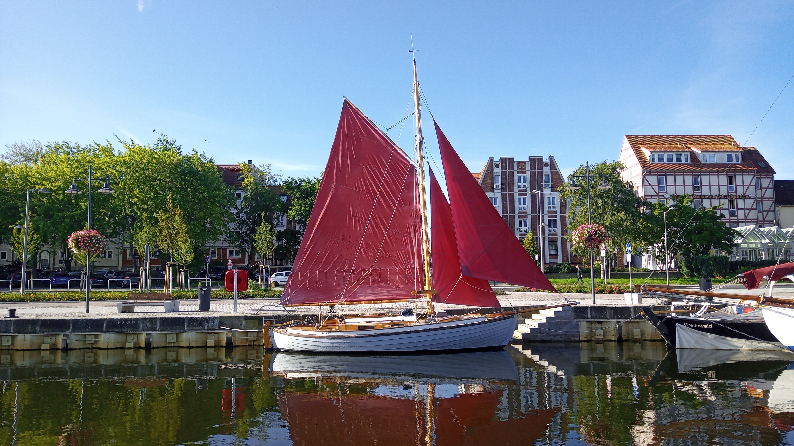
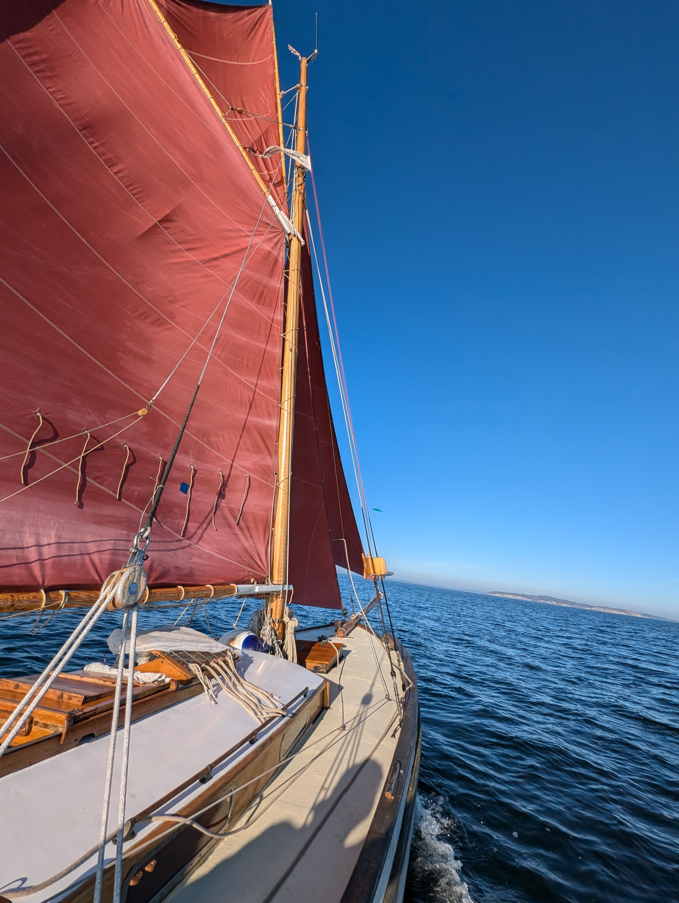
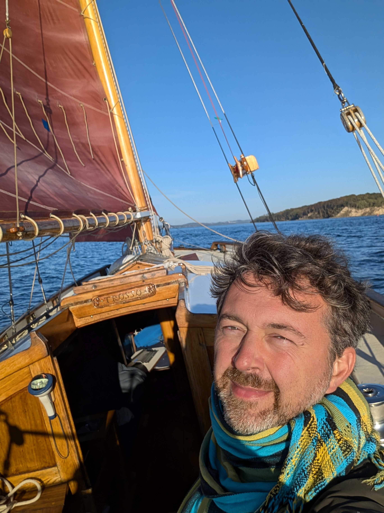

"Trossö" was built at [Rhyls Båt & Skeppsvarv](https://digitaltmuseum.se/011014863986/ryhls-bat-och-skeppsvarv) in Åhus, Sweden, in 1942. Her naval architect was [Knud Reimers](https://en.wikipedia.org/wiki/Knud_Reimers). Currently, her home port is [Greifswald](https://museumshafen-greifswald.de/). You can find more information on the ship [here](/files/döhler2024_trossö.pdf) (in German).

